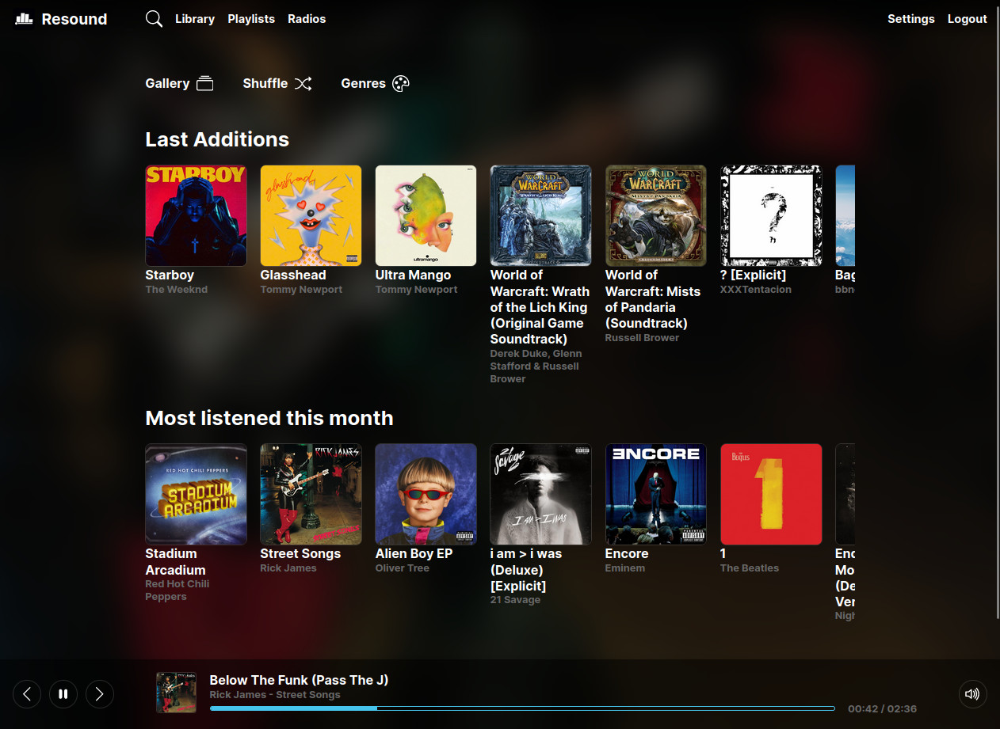

<p align="center">
    
</p>

# Re-Sound - Remote music library \[WIP]

Play your local music file remotely !

Resound is a web music-player that can be used to play your local music files from everywhere

## Purpose / Goal

Having your MP3s on a disk is an easy thing to manage, managing them between your PC, phone, and other devices is really something else

The purpose of Re-Sound is to store all of your files on one device, and use this Resound to play them on any device !

## Features

- Full library discovery
- MP3 file parsing (MetaData + Covers)
- Listening statistics
- Full gallery + Shuffle
- Music Genre Gallery
- MediaSession & Media signal support (Play/Pause, Next, Previous...)

<p align="center">
    
</p>


## Requirements

- Internet connection
- SQL Database
- PHP 8
- FTP Server on Library device

## Installation

First, clone the application and make an empty configuration

```bash
git clone https://github.com/yonis-savary/resound.git --recursive

cd resound

# Get default configuration
cp sharp.json.example sharp.json

# Install dependencies
php do build
```

Create a database using [Resound/SCHEMA.sql](./Resound/SCHEMA.sql), then configure the connection in `sharp.json`

```json
"database": {
    "driver": "mysql",
    "database": "resound",
    "host": "localhost",
    "port": 3306,
    "user": "root",
    "password": "somepassword"
}
```

Create a user of your choice with
```bash
php do create-user
```

Then, you can either connect to your server through a HTTP Server like Apache, or launch `php do serve` to launch PHP's built-in server

When connected to Re-Sound:
- go to the 'Settings' page (top-right corner of the window)
- configure the FTP Connection to your library
- click the `'Discover new tracks'` button

## More

### Mood mode

Click on the 'mood-mode' button (vinyl icon) next to the 'skip' button to create a new tracklist from currently played song,
next songs are now of the same artist/genre !


### Advanced Bluetooth/Hands-Free control

If your audio device has controls with the 'skip' and 'previous' buttons :
- Press 'previous' two times quickly to shuffle through your entire library
- Press 'skip' two times quickly to enable mood-mode !

This way, you can quickly choose what you want to listen without looking at your library

### CRON

You can add a [CRON](https://en.wikipedia.org/wiki/Cron) job to discover new files instead of clicking `'Discover new tracks'` button every time music is added to your library

```cron
0 * * * * cd /dir-to-resound && php do discover-new-files
```

This way, a process to discover new files is launched every hour