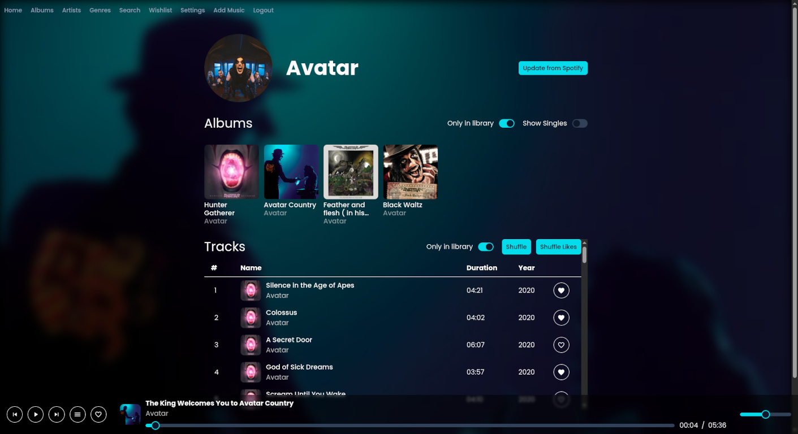

<p align="center">
    
</p>

# Resound - Listen to your music library remotely !

## Features

- MP3 Tag Parsing
- Web Music Player (+PWA)
- Explore your library by album/artist/genre
- Search for artist / album / songs
- Import music data from Spotify (Need Api Key) + Whishlist feature
- Files addition through the app (Support for large files)

Todo :
[ ] - Playlist system
[ ] - Web radio / Youtube Embedded implementation
[ ] - Import playlist from youtube / text ?

<p align="center">
    
</p>

## Installation

Requirements: docker

```bash
# Setup
git clone git@github.com:yonis-savary/resound-v2.git
cd resound-v2
docker compose up -d
```

For production:
```bash
docker compose build --build-arg ENVIRONMENT=prod
```


> [!WARNING]
> A default "root:root" user is created for the application, it is advised that your delete it if you don't want it


## Credits

Radar sound : Sound Effect by <a href="https://pixabay.com/users/freesound_community-46691455/?utm_source=link-attribution&utm_medium=referral&utm_campaign=music&utm_content=35955">freesound_community</a> from <a href="https://pixabay.com/sound-effects//?utm_source=link-attribution&utm_medium=referral&utm_campaign=music&utm_content=35955">Pixabay</a>